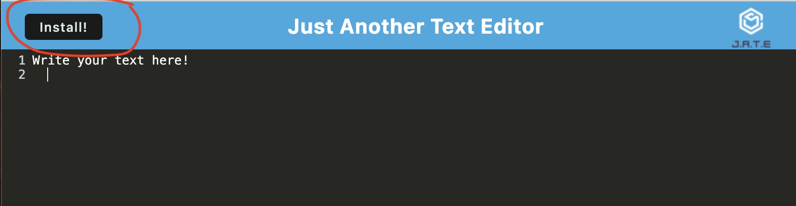

<!-- Improved compatibility of back to top link: See: https://github.com/othneildrew/Best-README-Template/pull/73 -->
<a name="readme-top"></a>
<!--
*** Thanks for checking out the Best-README-Template. If you have a suggestion
*** that would make this better, please fork the repo and create a pull request
*** or simply open an issue with the tag "enhancement".
*** Don't forget to give the project a star!
*** Thanks again! Now go create something AMAZING! :D
-->


<!-- PROJECT SHIELDS -->
<!--
*** I'm using markdown "reference style" links for readability.
*** Reference links are enclosed in brackets [ ] instead of parentheses ( ).
*** See the bottom of this document for the declaration of the reference variables
*** for contributors-url, forks-url, etc. This is an optional, concise syntax you may use.
*** https://www.markdownguide.org/basic-syntax/#reference-style-links
-->
[![Contributors][contributors-shield]][contributors-url]
[![Forks][forks-shield]][forks-url]
[![Stargazers][stars-shield]][stars-url]
[![Issues][issues-shield]][issues-url]
[![MIT License][license-shield]][license-url]
[![LinkedIn][linkedin-shield]][linkedin-url]


<!-- PROJECT LOGO -->
<br />
<div align="center">
  <a href="https://github.com/williamk31/PWA-Text_Editor">
  </a>

<h3 align="center">PWA Text Editor</h3>

  <p align="center">
    This project is a simple text editor that is deployed as a Progressive Web Application, allowing the user to install the application on their own machine and run it locally. 
    <br />
    <a href="https://github.com/williamk31/PWA-Text_Editor"><strong>Explore the docs »</strong></a>
    <br />
    <br />
    <a href="https://github.com/williamk31/PWA-Text_Editor">View Demo</a>
    ·
    <a href="https://github.com/williamk31/PWA-Text_Editor/issues/new?labels=bug&template=bug-report---.md">Report Bug</a>
    ·
    <a href="https://github.com/williamk31/PWA-Text_Editor/issues/new?labels=enhancement&template=feature-request---.md">Request Feature</a>
  </p>
</div>


<!-- TABLE OF CONTENTS -->
<details>
  <summary>Table of Contents</summary>
  <ol>
    <li>
      <a href="#about-the-project">About The Project</a>
      <ul>
        <li><a href="#built-with">Built With</a></li>
      </ul>
    </li>
    <li>
      <a href="#getting-started">Getting Started</a>
      <ul>
        <li><a href="#prerequisites">Prerequisites</a></li>
        <li><a href="#installation">Installation</a></li>
      </ul>
    </li>
    <li><a href="#usage">Usage</a></li>
    <li><a href="#contributing">Contributing</a></li>
    <li><a href="#license">License</a></li>
    <li><a href="#contact">Contact</a></li>
    <li><a href="#acknowledgments">Acknowledgments</a></li>
  </ol>
</details>


<!-- ABOUT THE PROJECT -->
## About The Project

<p align="right">(<a href="#readme-top">back to top</a>)</p>

### Built With

* ![JavaScript][JavaScript-Shield]
* ![NodeJS]
* [](https://webpack.js.org/)
* [](https://developers.google.com/web/tools/workbox)
* 

<p align="right">(<a href="#readme-top">back to top</a>)</p>


<!-- GETTING STARTED -->
## Getting Started

This Progressive Web Application is a simple text editor that the user can download to their local machine and use offline. The application will save text locally until a connection is made with the server.

### Prerequisites

Must have a web browser, preferable Chrome, installed locally, and a good internet connection to first access the application.

### Installation

To install the application, simply click on the "Install" button on the upper left hand corner of the window:

If you'd like to run the program locally on your machine, you may clone the code, and then run 
```sh
npm install
```
to install the dependencies, and then 
```sh
npm run build
```
to build the web application, and then
```sh
npm run start:dev
``` 
to start the server.

<p align="right">(<a href="#readme-top">back to top</a>)</p>


<!-- USAGE EXAMPLES -->
## Usage

Follow the link below to be taken to the deployed application:

<p align="right">(<a href="#readme-top">back to top</a>)</p>


<!-- ROADMAP -->

<!-- CONTRIBUTING -->
## Contributing

Contributions are what make the open source community such an amazing place to learn, inspire, and create. Any contributions you make are **greatly appreciated**.

If you have a suggestion that would make this better, please fork the repo and create a pull request. You can also simply open an issue with the tag "enhancement".
Don't forget to give the project a star! Thanks again!

1. Fork the Project
2. Create your Feature Branch (`git checkout -b feature/AmazingFeature`)
3. Commit your Changes (`git commit -m 'Add some AmazingFeature'`)
4. Push to the Branch (`git push origin feature/AmazingFeature`)
5. Open a Pull Request

<p align="right">(<a href="#readme-top">back to top</a>)</p>


<!-- LICENSE -->
## License

Distributed under the MIT License. See `LICENSE.txt` for more information.

<p align="right">(<a href="#readme-top">back to top</a>)</p>


<!-- CONTACT -->
## Contact

William Kalish - williamk31@williamk31@gmail.com.com

Project Link: [https://github.com/williamk31/PWA-Text_Editor](https://github.com/williamk31/PWA-Text_Editor)

<p align="right">(<a href="#readme-top">back to top</a>)</p>


<!-- ACKNOWLEDGMENTS -->
## Acknowledgments

* This README file template was created by [@othneildrew](https://github.com/othneildrew) - the original can be found [here](https://github.com/othneildrew/Best-README-Template)

<p align="right">(<a href="#readme-top">back to top</a>)</p>


<!-- MARKDOWN LINKS & IMAGES -->
<!-- https://www.markdownguide.org/basic-syntax/#reference-style-links -->
[contributors-shield]: https://img.shields.io/github/contributors/williamk31/PWA-Text_Editor.svg?style=for-the-badge
[contributors-url]: https://github.com/williamk31/PWA-Text_Editor/graphs/contributors
[forks-shield]: https://img.shields.io/github/forks/williamk31/PWA-Text_Editor.svg?style=for-the-badge
[forks-url]: https://github.com/williamk31/PWA-Text_Editor/network/members
[stars-shield]: https://img.shields.io/github/stars/williamk31/PWA-Text_Editor.svg?style=for-the-badge
[stars-url]: https://github.com/williamk31/PWA-Text_Editor/stargazers
[issues-shield]: https://img.shields.io/github/issues/williamk31/PWA-Text_Editor.svg?style=for-the-badge
[issues-url]: https://github.com/williamk31/PWA-Text_Editor/issues
[license-shield]: https://img.shields.io/github/license/williamk31/PWA-Text_Editor.svg?style=for-the-badge
[license-url]: https://github.com/williamk31/PWA-Text_Editor/blob/master/LICENSE.txt
[linkedin-shield]: https://img.shields.io/badge/-LinkedIn-black.svg?style=for-the-badge&logo=linkedin&colorB=555
[linkedin-url]: https://linkedin.com/in/williamk31
[product-screenshot]: images/screenshot.png
[Next.js]: https://img.shields.io/badge/next.js-000000?style=for-the-badge&logo=nextdotjs&logoColor=white
[Next-url]: https://nextjs.org/
[React.js]: https://img.shields.io/badge/React-20232A?style=for-the-badge&logo=react&logoColor=61DAFB
[React-url]: https://reactjs.org/
[Vue.js]: https://img.shields.io/badge/Vue.js-35495E?style=for-the-badge&logo=vuedotjs&logoColor=4FC08D
[Vue-url]: https://vuejs.org/
[Angular.io]: https://img.shields.io/badge/Angular-DD0031?style=for-the-badge&logo=angular&logoColor=white
[Angular-url]: https://angular.io/
[Svelte.dev]: https://img.shields.io/badge/Svelte-4A4A55?style=for-the-badge&logo=svelte&logoColor=FF3E00
[Svelte-url]: https://svelte.dev/
[Laravel.com]: https://img.shields.io/badge/Laravel-FF2D20?style=for-the-badge&logo=laravel&logoColor=white
[Laravel-url]: https://laravel.com
[Bootstrap.com]: https://img.shields.io/badge/Bootstrap-563D7C?style=for-the-badge&logo=bootstrap&logoColor=white
[Bootstrap-url]: https://getbootstrap.com
[JQuery.com]: https://img.shields.io/badge/jQuery-0769AD?style=for-the-badge&logo=jquery&logoColor=white
[JQuery-url]: https://jquery.com 
[JavaScript-shield]: https://shields.io/badge/JavaScript-F7DF1E?logo=JavaScript&logoColor=000&style=flat-square
[NodeJS]: https://img.shields.io/badge/node.js-6DA55F?style=for-the-badge&logo=node.js&logoColor=white
[Node-url]: https://nodejs.org/en
